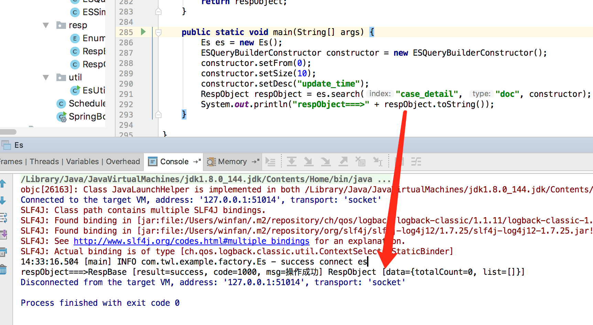

## SpringBoot1.5.9 + TransportClient + elasticsearch（6.2.4）
通过TransportClient操作elasticsearch

## 版本环境说明
| 名称 | 版本 | 说明 |
| :--- | :----: | ----: |
| jdk | 1.8 |  |
|  elasticsearch    | 6.2.4      |     |
|  logstash    | 6.2.4      |     |
|  kibana    | 6.2.4      |     |
| org.elasticsearch | 6.2.2 | |
| spring-boot | 1.5.9 | |

## elk安装方法
``` sh
#下载镜像
docker pull sebp/elk:624
#运行环境
docker run -d -p 5044:5044 -p 127.0.0.1:5601:5601 -p 127.0.0.1:9200:9200 -p 127.0.0.1:9300:9300  --name=elkes624 sebp/elk:624
```

## 项目结构如下
 ``` sh
  #以下结构输出方法,输出tree到 temp.md,然后复制到README.md文本中
 tree --dirsfirst --noreport -I README.md | sed 's/^/    /' > temp.md 
 ```
          .
          ├── doc
          │   └── QQ20180712-143741@2x.png
          ├── src
          │   ├── main
          │   │   ├── java
          │   │   │   └── com
          │   │   │       └── twl
          │   │   │           └── example
          │   │   │               ├── factory
          │   │   │               │   ├── Es.java
          │   │   │               │   └── EsFactory.java
          │   │   │               ├── queryBuilder
          │   │   │               │   ├── ESCriterion.java
          │   │   │               │   ├── ESQueryBuilderConstructor.java
          │   │   │               │   ├── ESQueryBuilders.java
          │   │   │               │   └── ESSimpleExpression.java
          │   │   │               ├── resp
          │   │   │               │   ├── EnumSystem.java
          │   │   │               │   ├── RespBase.java
          │   │   │               │   └── RespObject.java
          │   │   │               ├── util
          │   │   │               │   └── EsUtil.java
          │   │   │               ├── ScheduledLogger.java
          │   │   │               └── SpringBootLoggerApplication.java
          │   │   └── resources
          │   │       ├── application.properties
          │   │       └── logback-spring.xml
          │   └── test
          │       └── java
          ├── pom.xml
          ├── spring-boot-es-example.iml
          └── temp.md


### 关键依赖库
   ``` xml
       
        <dependency>
            <groupId>org.apache.commons</groupId>
            <artifactId>commons-pool2</artifactId>
            <version>2.0</version>
        </dependency>
        <dependency>
            <groupId>org.springframework.boot</groupId>
            <artifactId>spring-boot-starter-web</artifactId>
        </dependency>

        <dependency>
            <groupId>org.projectlombok</groupId>
            <artifactId>lombok</artifactId>
            <version>${lombok.version}</version>
        </dependency>
        <dependency>
            <groupId>net.logstash.logback</groupId>
            <artifactId>logstash-logback-encoder</artifactId>
            <version>4.9</version>
        </dependency>

        <dependency>
            <groupId>org.apache.commons</groupId>
            <artifactId>commons-collections4</artifactId>
            <version>4.0</version>
        </dependency>
        <dependency>
            <groupId>log4j</groupId>
            <artifactId>log4j</artifactId>
            <version>1.2.17</version>
        </dependency>
        <dependency>
            <groupId>org.slf4j</groupId>
            <artifactId>slf4j-log4j12</artifactId>
            <version>1.7.25</version>
        </dependency>
        <dependency>
            <groupId>org.slf4j</groupId>
            <artifactId>slf4j-api</artifactId>
            <version>1.7.25</version>
        </dependency>
        <!-- elasticsearch -->
        <dependency>
            <groupId>org.elasticsearch</groupId>
            <artifactId>elasticsearch</artifactId>
            <version>6.2.2</version>
        </dependency>
        <dependency>
            <groupId>org.elasticsearch.client</groupId>
            <artifactId>transport</artifactId>
            <version>6.2.2</version>
        </dependency>
    </dependencies>

   ```
 
## 创建es索引(index),添加type
> 如果没有这一步，程序会报错，找不到索引
### 首先查看es是索引信息
    ```sh
       curl -XGET http://localhost:9200/_cat/indices?v 
       #显示如果如下信息则无索引文件
       health status index       uuid                   pri rep docs.count docs.deleted store.size pri.store.size 
    ```
### 创建索引
   ```sh 
     curl -X PUT \
       http://127.0.0.1:9200/case_detail \  #case_detail 为索引名称
       -H 'Cache-Control: no-cache' \
       -H 'Content-Type: application/json' \ 
       -d '{  
         "settings":{  
             "number_of_shards": 5,  
             "number_of_replicas": 1  
         },  
         "mappings":{  
             "doc":{    # 这里doc代表type, 相当于mysql的表
                 "properties":{  
                     "id":{   # id为字段名，
                         "type": "keyword"  
                     },
                      "update_time":{  #更新时间段字段
                                         "type": "date"
                                     },
                 } 
             }
         }  
     } '
     
     #创建成功后返回如下信息
     {
         "acknowledged": true,
         "shards_acknowledged": true,
         "index": "case_detail"  #case_detail 为索引名称
     }
   ```
### 查看创建索引信息
```sh 
# curl http://localhost:9200/_cat/indices\?v
health status index       uuid                   pri rep docs.count docs.deleted store.size pri.store.size
yellow open   case_detail dlpZQ84eQV2fyfwrJ7pkwA   5   1          0            0      1.2kb          1.2kb

```

## 运行程序Es 的 main方法 如下图，执行成功，并没有数据，统计为0


